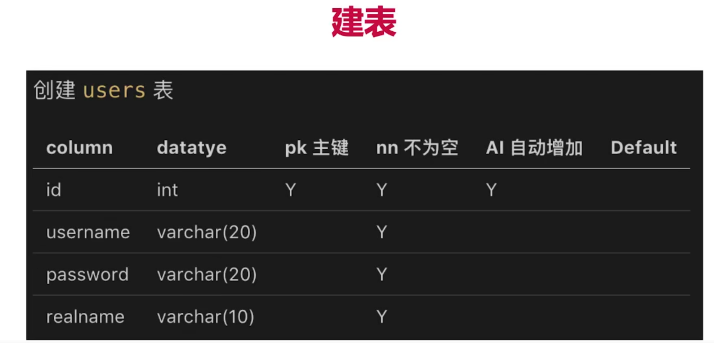

# Node.js 博客

npm init -y

- 从输入 url 到显示页面的整个过程是什么？
  - DNS 解析，建立 TCP 连接(三次握手)，发送 http 请求
  - server 接收到 http 请求，处理，并返回
  - 客户端接收到返回数据，处理数据(如渲染页面，执行 js)

## 项目步骤（不用框架）

postman 安装并切换到 desktop agent 才能访问 localhost

nodemon 监测文件变化，自动重启 Node

使用 cross-env 设置环境变量，兼容 mac、linux 和 windows

`npm install nodemon cross-env --save-dev`

package.json 中配置`"dev": "cross-env NODE_ENV=dev nodemon ./bin/www.js"`，然后使用`npm run dev`运行

初始化路由 blog.js 和 user.js

创建 model 文件夹，其中的 resModel.js 设置成功和失败的模型

创建 controller 文件夹，其中 blog.js 返回数据

在 router 文件夹中的 blog.js 中使用 controller 文件夹中 blog.js 的数据

使用 resModel.js 模型处理数据 success 或 error

promise and get post data

### 数据库

**安装：**

mysql 数据库，官网下载，自定义安装——安装 mysql server 和 mysql workbench(可视化操作)，按默认设置进行安装。**Authentication Method 选第二项**。

[安装教程 1](https://www.php.cn/mysql-tutorials-454993.html)
[安装教程 2](https://zhuanlan.zhihu.com/p/37152572)

**mysql workbench 操作数据库：**

建表要求




执行`update users set realname='李四2' where username='lisi'`出错；我们需要先运行`SET SQL_SAFE_UPDATES=0;`，一次就行。

删除操作，一般使用 state 做标记，0 为删除 1 为存在。不过项目中我们直接使用 del。

Mysql 操作命令：

```sql
use myblog;
-- show tables;
-- 插入
-- insert into users (username, `password`, realname) values ('zhangsan', '123', '张三');
-- insert into users (username, `password`, realname) values ('lisi', '123', '李四');
-- 查找
-- select * from users;
-- select id, username from users;
-- select * from users where password like '%1%';
-- select * from users where password like '%1%' order by id;
-- 反序
-- select * from users where password like '%1%' order by id desc;

-- SET SQL_SAFE_UPDATES=0; -- 执行一次让下边的更新可用
-- 实际上不使用的更新和删除操作，应该通过 state 来操作
-- update users set realname='李四2' where username='lisi';
-- delete from users where username='lisi';

-- 应该通过 state 来进行更新和软删除
-- select * from users where state='1';
-- update users set state='0' where username='lisi'

-- insert into blogs (title, content, createtime, author) values ('标题A', '内容A', '20210916', 'zhangsan');
-- insert into blogs (title, content, createtime, author) values ('标题B', '内容B', '20210917', 'lisi');
select * from blogs
```

**Nodejs 操作 Mysql:**

初始化项目及安装 mysql 库：

`npm init -y`
`npm i mysql --save`

Mysql 报错：

`Client does not support authentication protocol requested by server; consider upgrading MySQL client`

```sql
-- 解决方法，在 sql 命令行中面板中输入如下命令
USE mysql;
ALTER USER 'root'@'localhost'IDENTIFIED WITH mysql_native_password BY '密码';
-- 重启
FLUSH PRIVILEGES;
```

之后，创建 conf/db.js 文件，配置不同环境下（dev 开发环境和 production 生产环境）的 Mysql 连接信息（用户名、密码、端口、数据库名称等）。然后创建 db/mysql.js 文件，连接和定义一个操作 mysql 数据库的函数 exec。

删除 controller/blog.js 中的假数据，定义 sql 命令，然后返回 exec(sql)，即返回了对应 mysql 命令下的数据。然后在 router/blog.js 中获取和展示数据。

### 登录

**概要：**

登录校验和登录信息存储
cookie 和 session
session 写入 redis
开发登录功能，和前端联调（用到 nginx 反向代理）

- 什么是 cookie

  - 存储在浏览器的一段字符串（最大 5kb）
  - 跨域不共享
  - 格式如 k1=v1;k2=v2;k3=v3; 可以存储结构化数据
  - 每次发送 http 请求，会将请求域的 cookie 一起发送给 server
  - server 可以修改 cookie 并返回给浏览器
  - 浏览器中也可以通过 JavaScript 修改 cookie（有限制）

- session
  - cookie 会暴露 username 等，很危险
  - 解决：cookie 中存储 userid，server 端存储对应的 username
  - session，server 端存储用户信息
  - 即我们可以通过在浏览器端的 cookie 中设置随机的 userid，然后通过 userid 查找到 server 端中 session 的 username

cookie 设置：

```js
// 操作 cookie
// path=/ 让 cookie 在网站所有路由生效；httpOnly，只允许后端修改 cookie；expires 设置过期时间
res.setHeader(
  'Set-cookie',
  `username=${username}; path=/; httpOnly; expires=${getCookieExpires()}`
)
```

**redis:**

- session 适合用 redis
  - session 访问频繁，对性能要求极高
  - 数据量不大（相比于 mysql 中的数据）
  - redis 内存数据库

[redis 安装](https://www.runoob.com/redis/redis-install.html)
下载 redis 压缩包并解压，用 cmd 工具切换到 redis 目录（用 powershell 无效），输入：

`redis-server.exe redis.windows.conf` 启动 redis

然后再开一个 cmd 窗口，输入：

```bash
redis-cli.exe -h 127.0.0.1 -p 6379
# 基本操作
# 设置值
set myKey abc
# 获取值
get myKey
# 查看所有 key
keys *
# 删除
del myKey
```

nodejs 连接 redis，`npm i redis --save`安装库

项目中 redis 用来存储 session 中的 username 和 realname

**html 页面设置：**

http-server is a simple, zero-configuration command-line static HTTP server.

`npm i http-server -g`安装 http-server 库

切换到 html 文件夹里执行`http-server -p 8001`

nodejs 文件配置好的使用 npm run dev

**跨域问题：使用 nginx：**

配置 nginx，前后端同域联调。

在 cmd 中使。即使用 cmd，切换到 nginx 所在文件夹，执行 nginx 命令

nginx -t 可以测试配置文件 nginx.conf。

配置文件 nginx.conf 修改如下：

```bash
server {
        listen       8080;
        server_name  localhost;

        #charset koi8-r;

        #access_log  logs/host.access.log  main;

        # location / {
        #     root   html;
        #     index  index.html index.htm;
        # }
        location / {
            proxy_pass http://localhost:8001
        }
        location /api/ {
            proxy_pass http://localhost:8000
            proxy_set_header Host $host;
        }
```

**运行前后端。mysql 端口设置 8000；npm run dev 启动后端；需要启动 redis，`redis-server.exe redis.windows.conf`；html 使用 http-server -p 8001 启动；启动 nginx（nginx.conf 文件配置 8000 和 8001 端口都指向 8080 端口，解决跨域问题）。**

### stream 实现日志

访问日志、自定义日志

nodejs 文件操作，nodejs stream

日志存储到文件中，不存储在 mysql 和 redis 中

IO 包括网络 IO 和文件 IO，相比于 CPU 计算和内存读写，慢

按时间拆分日志：linux 的 crontab 命令，即定时任务

readline 逐行读取，分析日志内容

### 安全

1.sql 注入——使用 mysql.escape 解决

2.xss 攻击——预防措施：转换生成 js 的特殊字符

如在新建博客页面输入`<script>alert(document.cookie)</script>`会执行 js。

解决方法：将尖括号进行转换

`npm i xss --save`，使用 xss(内容) 进行转换

```js
// 将 &lt; 和 &gt; 转为尖括号
data.title = data.title.replace(/&lt;/gim, '<').replace(/&gt;/gim, '>')
```

3.密码加密
cryp.js

server 端设置密匙，将用户输入的密码（如 123）进行加密，即从 123 变为 xxxxru939201fjasdl 等加密密码，存进 mysql 数据库中。用户输入 123，则后台从数据库中找到 123 对应的加密密码，返回用户数据。

## express

安装 express：

- `npm install express-generator -g`安装
- `express 文件夹名` 生成项目
- `npm install` 后 `npm start`

nodemon：

- `npm install nodemon cross-env --save-dev`
- package 中在 scripts 中添加 dev 所在行的代码

  ```json
  "scripts": {
  "start": "node ./bin/www",
  "dev": "cross-env NODE_ENV=dev nodemon ./bin/www"
  }
  ```

中间件
get 请求：app.use()、app.get()
post 请求：app.use()、app.post()
没有 next() 则不会执行接下来的

`npm i mysql xss --save`

复用 bd/mysql.js、conf/db.js、controller文件夹、model文件夹、utils/crpy.js

使用 express-session 和 connect-redis 插件

`npm i express-session --save`
`npm i redis connect-redis --save`

`npm run prd` 后记录日志到 logs/access.log
